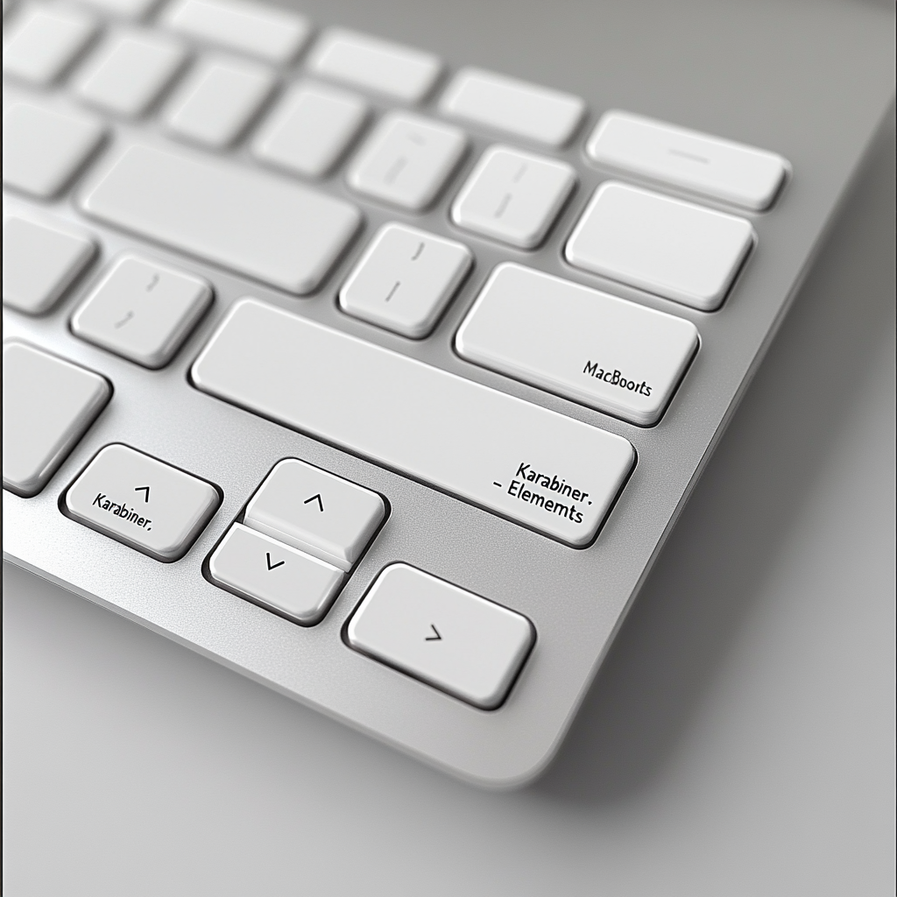

# Windows-style Keyboard Configuration for macOS



After using Windows for over 20 years, switching to macOS meant retraining my muscle memory. The Command key being the primary modifier instead of Control was particularly jarring. This configuration makes macOS keyboard shortcuts behave more like Windows, while adding German character support.

[](karabiner.json) [](LICENSE)

## Features

### Basic Key Remapping

- Swapped Control and Command keys
  - `left_control` ↔️ `fn`
  - Swap left/right command with left/right option
- Mapped `non_us_backslash` to `grave_accent_and_tilde (~)`

### Function Keys

- F1-F12 keys mapped to standard functions:
  - `fn + f1` → Display brightness decrement
  - `fn + f2` → Display brightness increment
  - `fn + f3` → Mission control
  - `fn + f4` → Spotlight
  - `fn + f5` → Dictation
  - `fn + f6` → F6
  - `fn + f7` → Rewind
  - `fn + f8` → Play/pause
  - `fn + f9` → Fast forward
  - `fn + f10` → Mute
  - `fn + f11` → Volume decrement
  - `fn + f12` → Volume increment

### Text Editing and Navigation

- Disabled Accent Mark Combinations

  - Disable `option+u` from producing accent mark
  - Disable `option+'` from producing accent mark
  - Disable `option+e` from producing accent mark

- Basic Windows Commands

  - `Ctrl + A` → Select all (`Cmd + A`)
  - `Ctrl + B` → Bold (`Cmd + B`)
  - `Ctrl + C, Ctrl + V, Ctrl + X` → Copy, Paste, Cut (`Cmd + C, Cmd + V, Cmd + X`)
  - `Ctrl + I` → Italic (`Cmd + I`)
  - `Ctrl + F` → Find (`Cmd + F`)
  - `Ctrl + N` → New (`Cmd + N`)
  - `Ctrl + S` → Save (`Cmd + S`)
  - `Ctrl + Z` → Undo (`Cmd + Z`)
  - `Ctrl + Y` → Redo (`Cmd + Shift + Y`)
  - `Ctrl + L` → Open URL location (Only in browsers)
  - `Ctrl + T` → New tab (`Cmd + T`)
  - `Ctrl + W` → Close (`Cmd + W`)

- Navigation Keys
  - `Home` → Move cursor to beginning of line (`Cmd + Left arrow`)
  - `Shift + Home` → Move cursor to beginning of line with selection (`Cmd + Shift + Left arrow`)
  - `Ctrl + Home, Ctrl + Shift + Home` → Move cursor to beginning of file with and without selection (`Cmd + Up arrow, Cmd + Shift + Up arrow`)
  - `End` → Move cursor to end of line (`Cmd + Right arrow`)
  - `Shift + End` → Move cursor to end of line with selection (`Cmd + Shift + Right arrow`)
  - `Ctrl + End, Ctrl + Shift + End` → Move cursor to end of file with and without selection (`Cmd + Down arrow, Cmd + Shift + down arrow`)
  - `Ctrl + (Shift) + Right/Left arrow` → Move cursor one word with and without selection (`Alt + (Shift) + Right/Left arrow`)
  - `Ctrl + Up/Down arrow` → Move cursor up/down (`Up/Down arrow`)

### Window Management

- `Alt + F4` → Exit application (`Cmd + Q`)
- `Ctrl + Esc` → Open Launchpad
- `Ctrl + Tab` → Switch application (`Cmd + Tab`)
- `Cmd + Tab` → Mission control (`Cmd + Alt + 0`)
- `Cmd + L` → Logout (`CGSession -suspend`)

### System Commands

- `Ctrl + Shift + Esc` → Open Activity Monitor

### Browser and Finder Specific

- `Ctrl + R` → Reload page (Only in browsers)
- `Return` → Open (`Cmd + O`) (Only in Finder)
- `F2` → Rename (Only in Finder)
- `Ctrl + Left Click` → Multi-select (`Cmd + Left Click`)

### Special Character Input

- Use the caps lock key state for other rules
- Convert Caps Lock with:
  - `[aou]` → `[äöü]`
  - `[AOU]` → `[ÄÖÜ]` (in combination with Shift)
  - `[s]` → `[ß]` (Eszett)

## Prerequisites

- macOS (tested on Sonoma)
- [Karabiner Elements](https://karabiner-elements.pqrs.org/)

## Installation

1. Install Karabiner Elements from their [official website](https://karabiner-elements.pqrs.org/)
2. Download the `karabiner.json` file from this repository
3. Place it in `~/.config/karabiner/`

```bash
# Backup your existing config (if any)
cp ~/.config/karabiner/karabiner.json ~/.config/karabiner/karabiner.json.backup

# Copy new config
cp karabiner.json ~/.config/karabiner/
```

## Privacy Note

Karabiner Elements takes privacy seriously - all keyboard processing happens locally on your machine. It just asks for the permissions it needs (input monitoring and admin privileges) and does its job without any cloud sync or telemetry.

## License

MIT License - Feel free to use and modify as needed.

## Acknowledgments

- [Karabiner Elements](https://karabiner-elements.pqrs.org/) team for their amazing tool
- The Event Viewer tool for making configuration debugging easier
